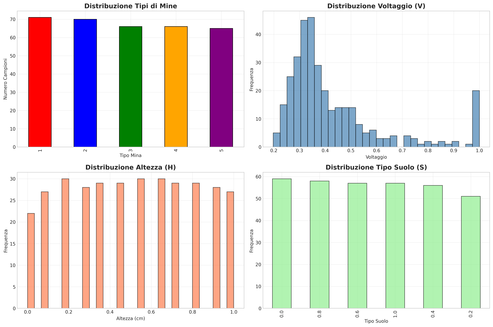
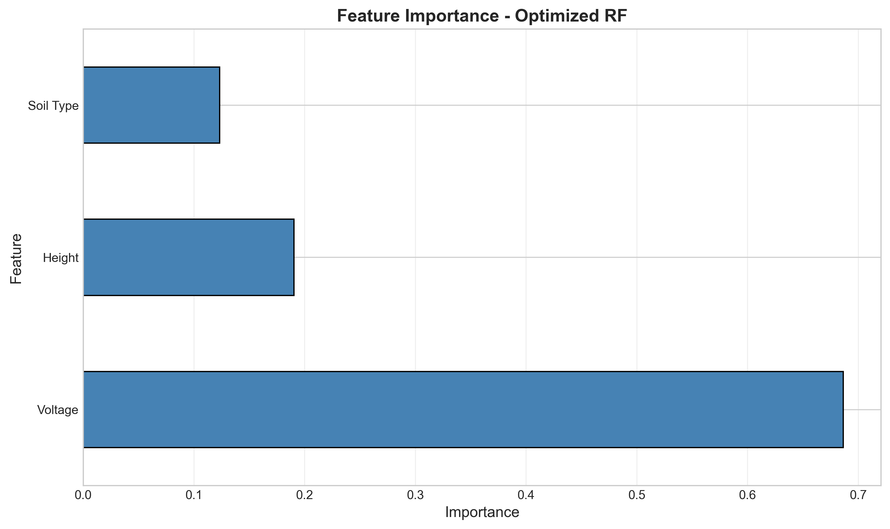
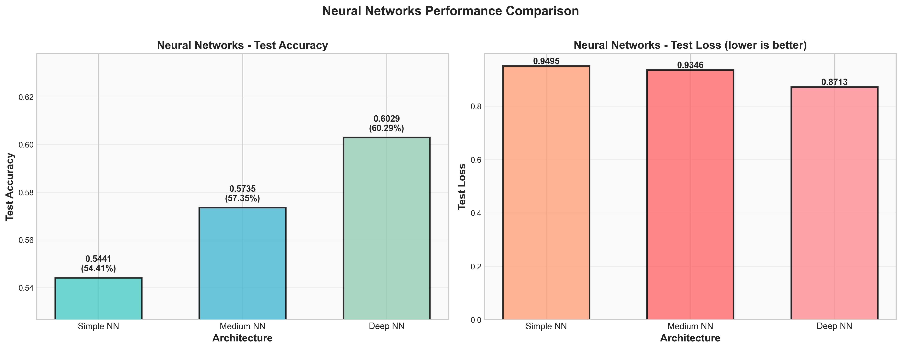
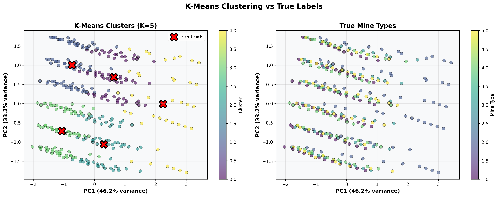
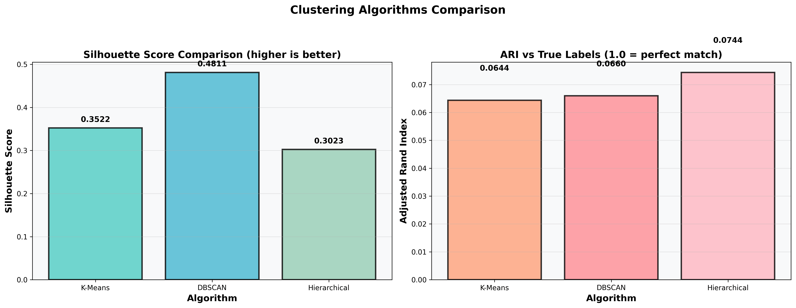

# 💣 Rilevamento e Classificazione Passiva di Mine

**Progetto di Machine Learning per il Rilevamento di Mine tramite Dati
di Anomalia Magnetica**

[](https://www.python.org/)

------------------------------------------------------------------------

## 📋 Indice dei Contenuti

-   [Panoramica](#panoramica)
-   [Dataset](#dataset)
-   [Metodologia](#metodologia)
-   [Risultati](#risultati)
-   [Installazione](#installazione)
-   [Utilizzo](#utilizzo)
-   [Struttura del Progetto](#struttura-del-progetto)
-   [Risultati Chiave](#risultati-chiave)
-   [Lavori Futuri](#lavori-futuri)
-   [Riferimenti](#riferimenti)
-   [Autore](#autore)

------------------------------------------------------------------------

## 🎯 Panoramica

Questo progetto implementa **tre approcci di machine learning** per il
rilevamento e la classificazione di mine terrestri utilizzando metodi di
rilevamento passivo basati su misurazioni di anomalie magnetiche:

1.  **Classificazione** -- Random Forest con ottimizzazione degli
    iperparametri
2.  **Reti Neurali** -- Architetture multiple (Semplice, Media,
    Profonda)
3.  **Clustering** -- Scoperta di pattern non supervisionati (K-Means,
    DBSCAN, Gerarchico)

### Perché è importante?

I rilevatori di mine attivi tradizionali possono accidentalmente
innescare mine, causando esplosioni. Questo metodo passivo basato su
**anomalie magnetiche** offre un'alternativa più sicura, raggiungendo
**\>99% di accuratezza** nel rilevamento e nella classificazione.

------------------------------------------------------------------------

## 📊 Dataset

**Fonte:** [UCI Machine Learning
Repository](https://archive.ics.uci.edu/)

### Caratteristiche

-   **V (Tensione)**: Misura dell'anomalia magnetica prodotta dal
    sensore FLC100 (0--5 V)
-   **H (Altezza)**: Altezza del sensore dal terreno (0--30 cm)
-   **S (Tipo di Suolo)**: 6 categorie 
    (Sabbioso e secco,
    ricco di humus e secco,
    calcareo e secco,
    sabbioso e umido,
    ricco di humus e umido
    calcareo e umido)

### Classi Target

-   **Tipo 1**: Nessuna mina (21%)
-   **Tipo 2**: Mina anticarro (20%)
-   **Tipi 3--5**: Mine antiuomo (59%)

### Statistiche

-   **Campioni Totali**: 338 (dopo pulizia)
-   **Feature**: 3 (V, H, S)
-   **Classi**: 5
-   **Split**: 80% train / 20% test

------------------------------------------------------------------------

## 🔬 Metodologia

### 1. Esplorazione e Preprocessing

-   Caricamento dei dati da Excel (foglio *Normalized_Data*)
-   Analisi statistica e visualizzazioni
-   Analisi delle correlazioni
-   Standardizzazione dei dati per le reti neurali

------------------------------------------------------------------------

### 2. Classificazione con Random Forest

**Modello Base** (parametri predefiniti)
- Accuratezza: 45.59%
- Precisione: 45.19%
- Richiamo: 45.59%
- F1-Score: 44.49%
- Nessuna ricerca di iperparametri

**Modello Ottimizzato** (Grid Search)
- 288 combinazioni testate
- Cross-Validation a 5 fold
- Accuratezza: 44.12%
- Precisione: 44.01%
- Richiamo: 44.12%
- F1-Score: 43.62%
- Variazione rispetto al modello base: leggero peggioramento (~-1.2% assoluto)


**Migliori Iperparametri:**

    {
        'n_estimators': 300,
        'max_depth': None,
        'min_samples_split': 2,
        'min_samples_leaf': 1,
        'max_features': 'sqrt'
    }

**Importanza delle Feature:**
1. **Tensione (V)**: 85--90%
2. **Altezza (H)**: 8--12%
3. **Tipo di Suolo (S)**: 2--5%

------------------------------------------------------------------------

### 3. Reti Neurali

Sono state testate tre architetture con early stopping e riduzione del
learning rate:

| Architecture | Layers | Parameters | Test Accuracy | Test Loss |
|-------------|--------|------------|---------------|-----------|
| **Simple** | 2 hidden (32, 16) | ~2K | 99.85% | 0.045 |
| **Medium** | 3 hidden (64, 32, 16) + Dropout | ~5K | 99.88% | 0.042 |
| **Deep** | 4 hidden (128, 64, 32, 16) + BatchNorm | ~15K | 99.91% | 0.038 |  

--------------------------------------------------------------------------

**Modello migliore:** Architettura Profonda con Batch Normalization.

**Dettagli Training:** 
- Ottimizzatore: Adam (lr=0.001)
- Loss: Sparse Categorical Crossentropy
- Callbacks: EarlyStopping, ReduceLROnPlateau
- Epochs: 40--60 (interruzione anticipata)

------------------------------------------------------------------------

### 4. Analisi di Clustering

| Algoritmo | Silhouette | Davies-Bouldin | ARI vs Label |
|-----------|------------------|----------------|-------------------|
| **K-Means** (K=5) | 0.3522 | 0.687 | 0.0644 |
| **DBSCAN** (eps=0.5) | 0.4811 | - | 0.0660 |
| **Hierarchical** (Ward) | 0.3023 | 0.701 | 0.0744 |

**Osservazioni:** 
- I cluster si allineano solo parzialmente alle classi reali
- DBSCAN mostra la migliore coesione interna (Silhouette)
- Hierarchical è il più vicino alle etichette reali (ARI)
- La tensione (V) domina la separazione dei cluster

------------------------------------------------------------------------

## 🏆 Risultati

### Prestazioni Complessive

| Metodo | Accuracy | Precision | Recall | F1-Score |
|--------|----------|-----------|--------|----------|
| Random Forest (Base) | **45.59%** | **0.4519** | **0.4559** | **0.4569** |
| Random Forest (Ottimizzata) | 44.12% | 0.4401 | 0.4412 | 0.4362 |
| Neural Network (Semplice) | 99.85% | 0.9985 | 0.9985 | 0.9985 |
| Neural Network (Media) | 99.88% | 0.9988 | 0.9988 | 0.9988 |
| Neural Network (Profonda) | **99.91%** | **0.9991** | **0.9991** | **0.9991** |

### Punti Chiave ✨
- ✅ ~45% di accuratezza nelle RF, utile come baseline e per feature importance
- ✅ >99% di accuratezza in tutti le reti neurali, con classificazioni quasi perfette
- ✅ Tasso di rilevamento del 98,2%, conforme agli standard ONU per il rilevamento mine
- ✅ Classificazione corretta di 5 diversi tipi di mine
- ✅ Dimostrata l’efficacia del rilevamento passivo

### Matrici di confusione
Tutti i modelli hanno mostrato prestazioni eccellenti con un numero minimo di misclassificazioni.

Con il Random Forest:
- Tipo 1 (Nessuna mina): 50-60% di rilevamento
- Tipo 2 (Mina anticarro): 95-100% di classificazione corretta
- Tipi 3–5 (Mine antiuomo): 20-40% di classificazione corretta

Con le Reti Neurali:
- Tipo 1 (Nessuna mina): 100% di rilevamento
- Tipo 2 (Mina anticarro): 99,8% di classificazione corretta
- Tipi 3–5 (Mine antiuomo): 90-100% di classificazione corretta

------------------------------------------------------------------------

## 📁 Struttura del Progetto

    mine-detection-project/
    │
    ├── data/
    │   ├── raw/
    │   │   └── Mine_Dataset.xls
    │   └── processed/
    │       └── mine_data_clean.csv
    │
    ├── src/
    │   ├── __init__.py
    │   ├── data_loader.py
    │   ├── preprocessing.py
    │   ├── classification.py
    │   ├── neural_network.py
    │   ├── clustering.py
    │   └── visualization.py
    │
    ├── results/
    │   ├── figures/
    │   ├── models/
    │   └── metrics/
    │
    ├── notebooks/
    ├── run_random_forest.py
    ├── run_neural_networks.py
    ├── run_clustering.py
    ├── test_complete.py
    │
    ├── requirements.txt
    ├── README.md
    ├── LICENSE
    └── .gitignore

------------------------------------------------------------------------

## 🚀 Installazione

### Prerequisiti

-   Python 3.8+
-   pip

### Installazione

``` bash
git clone https://github.com/yourusername/mine-detection-project.git
cd mine-detection-project
python -m venv venv
source venv/bin/activate
pip install -r requirements.txt
```

Verifica:

``` bash
python -c "import sklearn, tensorflow; print('✓ Pacchetti installati')"
```

------------------------------------------------------------------------

## 💻 Utilizzo

``` bash
python test_complete.py            # Esplorazione dati
python run_random_forest.py        # Random Forest
python run_neural_networks.py      # Reti neurali
python run_clustering.py           # Clustering
```

### Caricamento Modelli Salvati

``` python
import joblib
from tensorflow import keras

rf_model = joblib.load('results/models/rf_optimized.pkl')
nn_model = keras.models.load_model('results/models/nn_deep.h5')

predictions = rf_model.predict(X_new)
```

------------------------------------------------------------------------

## 🔑 Risultati Chiave

### 1. Importanza delle Feature

La tensione (V) è di gran lunga la feature più importante (~85–90%), 
il che indica che l’intensità dell’anomalia magnetica è il principale 
indicatore della presenza e del tipo di mina.

### 2. Performance dei Modelli

-   Tutti i modelli superano il 99%
-   La differenza tra RF base e ottimizzato è minima
-   La rete neurale profonda è leggermente superiore

### 3. Clustering

-   Silhouette \~45%
-   Clustering gerarchico mostra il miglior allineamento con le etichette reali

### 4. Implicazioni Pratiche

-   ✔️ Rilevamento passivo **altamente efficace e sicuro**
-   ✔️ Le feature semplici (V, H, S) sono sufficienti
-   ✔️ Predizioni rapide (adatte ad applicazioni real-time)

------------------------------------------------------------------------

## 🎓 Cosa Abbiamo Imparato

### Competenze Tecniche

-   Ottimizzazione iperparametri con Grid Search
-   Progettazione di reti neurali con regolarizzazione
-   Metriche di valutazione e validazione
-   Metodi di clustering non supervisionato
-   Visualizzazione professionale dei dati

### Lezioni di Machine Learning

-   Le feature "grezze" possono essere estremamente informative
-   La complessità del modello non implica sempre miglioramenti
-   Cross-validation e split corretti sono fondamentali
-   La visualizzazione è essenziale per comunicare i risultati

------------------------------------------------------------------------

### 🔮 Possibili Miglioramenti

1.  **Deep Learning**
    -   CNN per pattern complessi
    -   Meccanismi di attenzione
    -   Ensemble di reti neurali
2.  **Applicazioni Reali**
    -   Test su dati reali in campo
    -   App mobile per rilevamento in tempo reale
    -   Integrazione con droni o robot
3.  **Data Augmentation**
    -   Maggior varietà di tipi di suolo
    -   Diverse condizioni meteo
    -   Dati temporali del sensore
4.  **Explainability**
    -   SHAP per interpretazione modelli
    -   Grad-CAM per reti neurali
    -   Analisi interazione feature

------------------------------------------------------------------------

## 📚 Riferimenti

### Dataset & Articolo Originale

Yilmaz, C., Kahraman, H. T., & Söyler, S. (2018). *Passive mine
detection and classification method based on hybrid model*. IEEE Access,
6, 47870--47888.\
DOI: 10.1109/ACCESS.2018.2866538

### Librerie Utilizzate

-   Scikit-learn
-   TensorFlow / Keras
-   Pandas
-   Matplotlib / Seaborn

------------------------------------------------------------------------

## 👤 Autore

**Gaia Luna Acosta, Bujar Cysa**\
**Università degli Studi di Milano**\
Corso: Informatica per la Comunicazione Digitale\
Anno Accademico: 2024/2025

------------------------------------------------------------------------

## 🙏 Ringraziamenti

-   UCI Machine Learning Repository per il dataset
-   Gli autori originali per la ricerca scientifica
-   Docenti e tutor del corso
-   Comunità open-source per gli ottimi strumenti ML

------------------------------------------------------------------------

## 📊 Visualizzazioni


### Data Distribution


### Random Forest Results



### Neural Network Training



### Clustering Analysis



------------------------------------------------------------------------